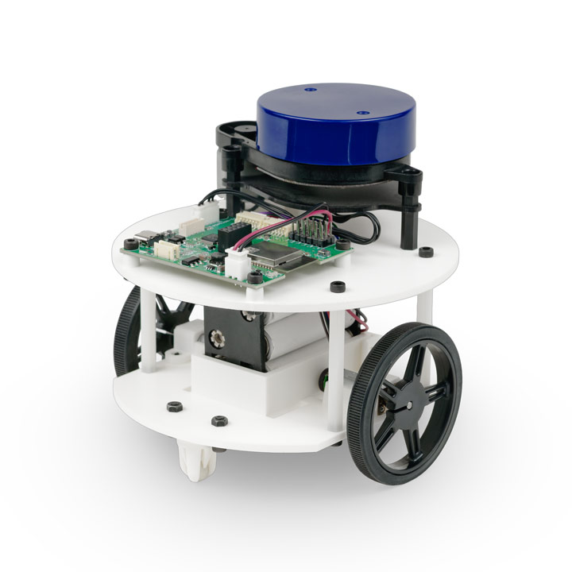

# ライトローバーE32 ROS2パッケージ

<p align="center">
  
</p>

ヴイストン株式会社より発売されている小型移動台車「[ライトローバーE32](https://www.vstone.co.jp/products/lightroverE32/index.html)」をROS 2で制御するためのパッケージです。別途Linux搭載PC及びロボット実機が必要になります。

# 目次
<!-- TOC -->

- [概要](#%E6%A6%82%E8%A6%81)
- [必要機器 & 開発環墁](#%E5%BF%85%E8%A6%81%E6%A9%9F%E5%99%A8--%E9%96%8B%E7%99%BA%E7%92%B0%E5%A2%83)
- [ファイルの構成](#%E3%83%95%E3%82%A1%E3%82%A4%E3%83%AB%E3%81%AE%E6%A7%8B%E6%88%90)
- [パッケージ構成](#%E3%83%91%E3%83%83%E3%82%B1%E3%83%BC%E3%82%B8%E6%A7%8B%E6%88%90)
- [インストール方法](#%E3%82%A4%E3%83%B3%E3%82%B9%E3%83%88%E3%83%BC%E3%83%AB%E6%96%B9%E6%B3%95)
- [ライセンス](#%E3%83%A9%E3%82%A4%E3%82%BB%E3%83%B3%E3%82%B9)
- [貢献](#%E8%B2%A2%E7%8C%AE)

<!-- /TOC -->

## 概要

このパッケージは、ライトローバーE32台車ロボット用のROS 2パッケージを提供します。 
このパッケージには、ロボットの制御、センサーの読み取り、およびロボットアプリケーションの開発に必要なノードが含まれています。

## 必要機器 & 開発環墁
-  ライトローバーE32:
  - 製品ページ: [https://www.vstone.co.jp/products/lightroverE32/index.html](https://www.vstone.co.jp/products/lightroverE32/index.html)
  - 販売ページ: [https://www.vstone.co.jp/robotshop/index.php?main_page=product_info&cPath=928_953&products_id=5440](https://www.vstone.co.jp/robotshop/index.php?main_page=product_info&cPath=928_953&products_id=5440)
- Ubuntu Linux - Jammy Jellyfish (22.04)
- ROS 2 Humble Hawksbill

## ファイルの構成
   ```
    ros2_ws/src
    ━lightrover_e32_ros2
    │　━lightrover_e32
    │　━lightrover_e32_bringup
    │　━lightrover_e32_navigation
    │　━lightrover_e32_description
   ```

## パッケージ構成
- `lightrover_e32`: ライトローバーE32のメタパッケージ。
- `lightrover_e32_bringup`: ライトローバーE32の起動に関連するノードやlaunchファイルを提供します。
- `lightrover_e32_navigation`: ライトローバーE32のSLAMやNavigationに関連するノードやlaunchファイルを含んでいるパッケージです。
- `lightrover_e32_description`: ライトローバーE32の物理モデルやURDFモデルを含んでいるパッケージです。

## インストール方法
このパッケージのインストール方法を含めた、ライトローバーE32のセットアップ・使用方法については、[ライトローバーE32WEBドキュメント](https://vstoneofficial.github.io/lightrover_e32_webdoc/)をご参照ください。

## ライセンス

このパッケージはApache 2.0ライセンスの下で提供されています。詳細につきましては、[LICENSE](./LICENSE)ファイルを参照してください。

## 貢献

バグの報告や修正の提案など、このパッケージへの貢献は大歓迎です。プルリクエストやイシューを使用して、issueをご利用ください。
